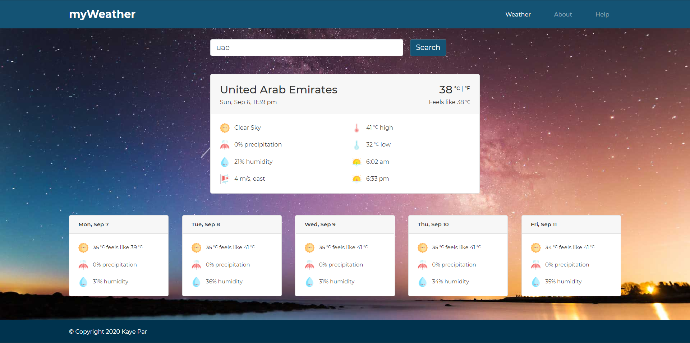

## Table of Contents

* [Weather App](#weather-App-(myWeather))
* [Getting Started](#getting-started)
  * [Prerequisites](#prerequisites)
  * [Installation](#installation)
* [Running the tests](#running-the-tests)
* [Built With](#built-with)
* [Acknowledgements](#acknowledgements)
* [Contact](#contact)


# Weather App (myWeather)

Displays weather forecast based on an address provided. Data comes from [ip-api](https://ip-api.com/), [mapbox](https://www.mapbox.com/) and [Weatherbit.io](https://www.weatherbit.io/) APIs.

**URL:** https://par-weather-app.herokuapp.com/

<div align="left">
     
</div>

## Getting Started

These instructions will get you a copy of the project up and running on your local machine for development and testing purposes. 

### Prerequisites

[Node.js](https://nodejs.org/en/) - get and install the latest version

### Installation

Follow below steps to setup the project on your local machine. 

1. Clone the project
    ```sh
    git clone https://github.com/kayepar/node-weather-app-bootstrap
    ```
2. Get project dependencies
    ```sh
    npm install
    ```
3. Create `config/dev.env` file
   * Get API keys from both **[mapbox](https://www.mapbox.com/)** and **[Weatherbit.io](https://www.weatherbit.io/)**
   * Save the API keys in `dev.env` file
  
      **Example:**
      ```JS
      MAPBOX_API_KEY=your_key
      WEATHERBIT_API_KEY=your_key
      ```
    
4. Start the server
    ```sh
    npm run dev
    ```
  
    You should see below console message if successful
    ```sh
    [nodemon] 2.0.4
    [nodemon] to restart at any time, enter `rs`
    [nodemon] watching path(s): *.*
    [nodemon] watching extensions: js
    [nodemon] starting `node src/index.js hbs`
    Server running on port 80
    ```

   * Access `http://localhost` on your browser to view the app
   * Should you wish to change the default port, open `src/index.js` and modify the port variable assignment
      ```JS
      const port = process.env.PORT || 80;
      ```

   * Basic logging available in console for every search
      ```sh
      {
        data: [
          {
            date: '2020-08-30',
            temp: 86,
            temp_high: 90,
            temp_low: 84,
            weather_code: 804,
            weather_description: 'Overcast clouds',
            feels_like: 101,
            chance_of_rain: '50%',
            humidity: '70%',
            sunset: '6:12 pm',
            sunrise: '5:47 am',
            wind_speed: 11,
            wind_direction: 'west'
          },
          ...
        ],
        city_name: 'Quiapo',
        lon: 121,
        timezone: 'Asia/Manila',
        lat: 14.58,
        country_code: 'PH',
        state_code: 'NCR',
        isDay: false,
        location: 'Manila, Philippines'
      }
      ```

## Running the tests

* Start automated tests
  ```sh
  npm test
  ```

  **Example result:**
  ```sh
  PASS  tests/app.test.js
    √ Should get main page (129 ms)
    √ Should get help page (34 ms)
    √ Should get about page (28 ms)
    √ Should get 404 for help subpages (28 ms)
    √ Should get 404 for any non existing page (33 ms)
    √ Should not get weather for empty address (32 ms)
    √ Should not get weather for invalid address (122 ms)
    √ Should get weather for valid address (620 ms)

  Test Suites: 1 passed, 1 total
  Tests:       8 passed, 8 total
  Snapshots:   0 total
  Time:        6.199 s
  Ran all test suites.
  ```

## Built With

* [Node.js](https://nodejs.org/en/) - Server side runtime
* [npm](https://www.npmjs.com/) - Package management
* [Express.js](https://expressjs.com/) - Web application framework
* [express-hbs](https://www.npmjs.com/package/express-hbs) - Template engine
* [Jest](https://jestjs.io/) - Testing framework
* [Bootstrap](https://getbootstrap.com/) - Front-end framework

## Acknowledgements

* [Unsplash](https://unsplash.com/)
* [Flaticon](https://www.flaticon.com/)
* [Font Awesome](https://fontawesome.com/)
* [Heroku](https://www.heroku.com/)
* [Moment.js](https://momentjs.com/)
* [Request-Promise](https://www.npmjs.com/package/request-promise)

## Contact
Catherine Par - kaye.cenizal@gmail.com

LinkedIn - https://www.linkedin.com/in/catherine-par-bbba221a2/